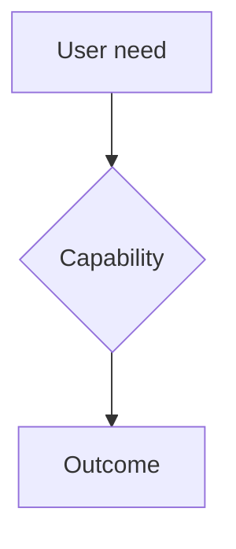

# EPIC-000 · <Epic title>

## Problem & context
<What business problem this addresses and why now.>

## Goal & business value
<The outcome and its value. Fit-for-Purpose: state the smallest outcome that counts as success.>

## Success metrics
- <measurable signal>

## Scope
- In: <…>

## Non-goals (YAGNI)
- <explicitly out of scope>

## User stories
- US-000 - <story title>

## High-level flow

## Dependencies & risks
- <…>
