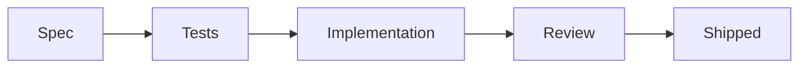

# Iteration · <title>

## What was built
<Plain summary of the change and the outcome delivered.>

## Satisfies
- <SPEC/US/TASK IDs and how each acceptance criterion was met>

## Key decisions
- <decision → link ADR if any>

## Tests added
- <test → criterion>

## Files changed (summary)
- <area: short note>

## Diagram (if helpful)

## Follow-ups
- [ ] <next>
