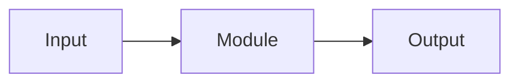

# SPEC-000 · <Technical spec title>

## Summary
<What is being built, in two sentences.>

## Acceptance criteria (Given/When/Then)
1. …

## Design
### Modules / files (single responsibility)
| File | Responsibility | Depends on |
|---|---|---|
| <path> | <one job> | <abstraction> |

### Component / data flow


### Public interfaces
```ts
// signatures only
```

## Test plan
| Acceptance criterion | Test |
|---|---|
| 1 | <test> |

## Non-goals (YAGNI) & rejected options
- <cut item / simpler choice over a complex one and why>

## Dependencies
- <each new dependency justified>
