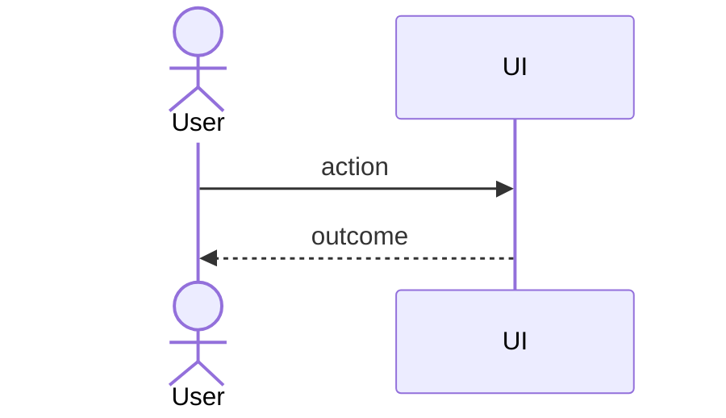

# US-000 · <User story title>

> As a <role>, I want <capability> so that <benefit>.

## Acceptance criteria
1. **Given** <context> **when** <action> **then** <observable outcome>.
2. **Given** … **when** … **then** …

## Scope / Non-goals (YAGNI)
- In: <…>
- Out: <…>

## Tasks
- TASK-000 - <task title>

## Notes / diagram (optional)

