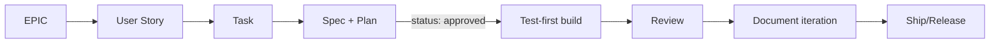

# docs/ - project documentation (source of truth)

All planning and documentation lives here as structured Markdown with Mermaid
diagrams. This folder is the project's memory and the gate for Spec-Driven
Development: **code requires an approved spec.**

## Structure
| Folder | Contains | ID prefix |
|---|---|---|
| `adr/` | Architecture Decision Records | `ADR-` |
| `profile/` | CV source data + generation instructions | - |

## Lifecycle (SDLC + SDD)

## Status values
`draft` → `approved` → `in-progress` → `done`. Only a human sets `approved`.

## Rules
- Templates live in `.claude/templates/`. Use them.
- Every doc starts with a front-matter block (id, title, status, created, updated,
  cross-links).
- Add a Mermaid diagram whenever a flow/sequence/data-model/state is clearer
  visually.
- After any approved iteration, add an `iterations/ITER-*` log (mandatory).
