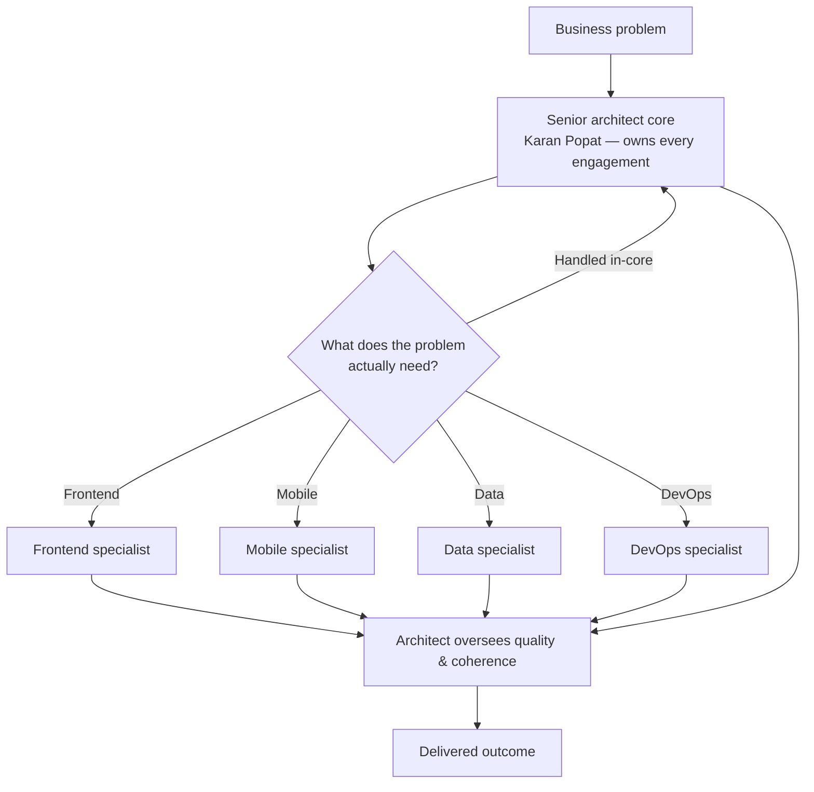

# HeadlessEngineer — Business Profile

> **How to use this document.** This is the authoritative narrative for the
> business. Marketing copy, onboarding material, the service catalogue, and
> proposals should be generated *from* this file — not invented alongside it.
> When copy and this document disagree, this document wins for facts; the
> `brand` skill wins for voice. For anything technical (stack, engineering
> practice, delivery mechanics), see the companion
> [Technical Profile](./technical-profile.md). For the *why* behind the name,
> the tagline, the singular-naming convention, and the mindset, see
> [Brand Philosophy](./brand-philosophy.md).

---

## 1. At a Glance

| Field | Value |
|---|---|
| **Name (running text)** | `headlessengineer` — one word, lowercase |
| **Name (display / logo)** | `HEADLESSENGINEER` — one word, uppercase |
| **Name (title case, brand chrome)** | `HeadlessEngineer` |
| **What it is** | A technology consultancy that solves business problems with the right technology |
| **One-liner** | "A technology consultancy for hard business problems." |
| **Tagline** | "the head your problem needs." |
| **Subline** | "Senior minds, the right technology, and pragmatic engineering — pointed at the problems that don't have easy answers." |
| **Vision** | Tech solutions for business problems |
| **Founder** | Karan Popat — Founder & Lead Architect |
| **Operating model** | Core-plus-network: senior architectural core + a growing network of vetted specialists |
| **Location** | Berlin, Germany |
| **Domain** | `https://headlessengineer.xyz` |
| **Email** | `contact@headlessengineer.xyz` |
| **Scheduling** | `https://calendar.app.google/VDfc1ju38MvMMucKA` |
| **GitHub** | `github.com/headlessengineer` |
| **LinkedIn** | `linkedin.com/in/headlessengineer` |
| **X / Twitter** | `@headlessengineer` |

> **Domain note.** The final, authoritative domain is **`headlessengineer.xyz`**.
> Any reference to `headlessengineer.studio` is stale (it survives only in the
> `rebranding/` scaffolding folder) and must not be used in new material.

---

## 2. What the Name Means

**headlessengineer** is one word. A *headless* system is a capable backend that
attaches to *any* front end. The brand applies that idea to engineering talent:
a constant core of engineering rigor that adopts any technology, any stack, any
domain — the body stays, the head swaps.

That metaphor is the entire argument of the business: clients get senior
engineering judgment that is not bound to one toolset. It also drives the visual
system (a fixed neutral foundation + one swappable accent) — see the
[Technical Profile](./technical-profile.md#13-design-system-summary).

**The name is singular on purpose.** `headlessengineer` — never
`headlessengineers` — for the same reason a database entity is named `User` even
though the table holds thousands of rows: a singular name describes the *type* of
thing, not the count. It names the archetype of adaptable senior judgment; the
network of specialists who deliver it is the implied collection. This is also why
the tagline stays singular ("**the** head your problem needs.") and the plurality
lives in the subline. Full reasoning in [Brand Philosophy](./brand-philosophy.md).

**Naming rules (non-negotiable):**

- Running text: always lowercase — `headlessengineer`
- Logo / wordmark: always uppercase — `HEADLESSENGINEER`
- Never two words, never camelCase, never abbreviated, never a space between
  HEADLESS and ENGINEER

---

## 3. Vision & Mission

- **Vision:** tech solutions for business problems.
- **Mission:** translate real business needs into working software — choosing
  and adopting whatever technology fits the problem, rather than forcing every
  problem into one stack.

Always lead with the **outcome** (the business problem solved), not the
**mechanism** (the framework used).

---

## 4. Positioning

> For founders, product owners, and engineering leaders who have a business
> problem and want it solved well — HeadlessEngineer is the adaptable
> engineering partner that brings senior rigor to any stack, instead of a fixed
> toolset or a lecture on frameworks.

| We are | We are not |
|---|---|
| Adaptable | Dogmatic about tools |
| Pragmatic | Hype-driven |
| Business-literate | Jargon-first |
| Senior / calm | Junior |
| Precise | Clever for its own sake |

**Differentiators to lead with:** AI-native, stack-agnostic, outcome-led;
senior engineers and architects staffed to the problem, not a one-person shop.

---

## 5. Who We Serve

Derived from the positioning and the shape of the offerings:

| Audience | The trigger that brings them to us |
|---|---|
| **Founders / startups** | Need senior technical judgment before they can justify a full-time CTO |
| **Product owners** | Have a business problem, not a spec, and need it translated into a buildable plan |
| **Engineering leaders** | Need extra senior capacity, an architecture that survives scale, or a team whose standard rises |
| **Enterprises (esp. commerce)** | Legacy platforms holding the business back; multi-country, B2B/B2C/D2C complexity |

Industries with demonstrated depth: automotive, manufacturing, FMCG, sportswear,
and retail — largely through enterprise e-commerce engagements.

---

## 6. The Problems We Solve

The client-facing framing of the offer. Each is a problem statement, not a
service name — always lead with the problem.

1. **"You have a business problem, not a spec."** — Technology audits, build-vs-buy,
   roadmapping. Start from what's actually broken and design a roadmap that fits
   the timeline, budget, team, and risk appetite.
2. **"Your architecture needs to survive scale."** — Solution and enterprise
   architecture, system design. Systems that hold together as they grow, from a
   single platform to org-wide technology coherence.
3. **"You need it built, not just diagrammed."** — Full-stack engineering, API
   design, cloud-native systems. We build production software ourselves and bring
   in vetted specialists for depth we don't carry in-house.
4. **"Legacy is holding the business back."** — Platform modernisation, legacy
   replatforming, strangler-fig migrations. Move off systems that can't keep up,
   incrementally, without a risky big-bang rewrite.
5. **"AI should do real work, not a demo."** — Agentic workflows, LLM integration,
   process automation. Ship AI that removes actual manual work, not proofs-of-concept
   that stall after the pitch.

---

## 7. Operating Model — Core-Plus-Network

HeadlessEngineer is deliberately **not** a one-person shop and **not** a large
body-shop. It runs on a *core-plus-network* model: a senior architectural core
leads every engagement, and vetted specialists are brought in per engagement.

**Why it matters commercially:** clients get a single senior point of technical
accountability, pay only for the expertise a problem actually needs, and never
have a generalist stretched thin across a domain they don't own. As the network
matures it becomes a standing team; today it is assembled per engagement.

---

## 8. Service Catalogue

Four categories, seven active offerings. (An eighth — Team Augmentation &
Staffing — is defined but currently deferred/not published.)

### 8.1 Categories

| ID | Category |
|---|---|
| `strategy` | Strategy & Architecture |
| `build` | Build & Delivery |
| `ai` | AI & Automation |
| `leadership` | Leadership & Team |

### 8.2 Offerings

| Offering | Category | What it covers | Engagement model |
|---|---|---|---|
| **Technology Strategy & Discovery** | Strategy | Technology audits · build vs buy · roadmapping | Discovery sprint (2–4 weeks) or ongoing advisory |
| **Solution Architecture** | Strategy | System design · API-first design · domain-driven design | Fixed-scope architecture engagement |
| **Enterprise Architecture** | Strategy | Technology alignment · platform rationalisation · governance | Advisory retainer or scoped assessment |
| **Custom Software Engineering** | Build | Full-stack development · API design · cloud-native systems | Embedded delivery team or scoped build |
| **Platform Modernisation & Migration** | Build | Monolith→microservices · legacy replatforming · strangler fig | Phased migration roadmap plus delivery |
| **AI & Automation Consulting** | AI | Agentic workflows · LLM integration · process automation | Proof-of-concept through to production pipeline |
| **Fractional CTO / Technical Advisory** | Leadership | Technical strategy · architecture sign-off · investor & board support | Part-time or advisory retainer |
| *Team Augmentation & Staffing* (deferred) | Leadership | Specialist engineers · code-review standards · mentorship | Project-based staffing or embedded team extension |

**Catalogue CTA / positioning line:** *"Not sure which fits? Tell us the problem,
not the service you think you need — we'll figure out the right shape of
engagement together."*

### 8.3 Engagement Models at a Glance

- **Discovery sprint** — 2–4 weeks, fixed scope, produces a roadmap.
- **Fixed-scope engagement** — a defined architecture or build deliverable.
- **Embedded delivery** — team extension / scoped build.
- **Phased delivery** — migration roadmap executed in increments.
- **Advisory retainer** — part-time fractional CTO / enterprise advisory.

---

## 9. How We Work — Principles

What a client can expect from the engagement. Each principle pairs a stance with
concrete practice.

| Principle | What it means in practice |
|---|---|
| **We scope around the problem, not our own stack** | Technology-agnostic recommendations; honest build-vs-buy calls; bring in another specialist rather than force-fit |
| **We take ownership, not just tasks** | ADRs; incident ownership; thinking about six months after go-live, not just launch |
| **We test before we ship** | TDD, BDD, integration and acceptance testing — and we establish these practices in the teams we join |
| **We use AI to free up engineering judgment, not replace it** | Agentic tooling and automation handle the repetitive parts so engineers focus on design and architecture |
| **We raise the standard, not just the output** | Code review, engineering culture, compounding standards — a codebase should be in better shape after we've worked on it |

---

## 10. Where We Go Deep

Domains the business brings genuine judgment to — and the disciplines it staffs
around them. (Technical detail lives in the [Technical Profile](./technical-profile.md#4-capability-map).)

| Domain | Headline |
|---|---|
| **Enterprise & Solution Architecture** | Design at both the system level and the organisational level |
| **Distributed Systems & Cloud-Native Engineering** | Backend systems designed to run at real load, owned end-to-end |
| **Digital Commerce Platforms** | A specialty, not a boundary — certified depth built over 12+ years across B2B/B2C/D2C |
| **AI & Agentic Systems** | Production agentic automation, not notebooks |
| **Technical & Delivery Leadership** | Senior judgment applied to how a team works, not just what it ships |

---

## 11. Proof & Track Record

Headline metrics (use in marketing and proposals):

| Figure | Label |
|---|---|
| **12+** | Years shipping enterprise systems |
| **26** | Countries in production |
| **9–15** | Engineer teams led |
| **0** | Problems declined because of stack |

Representative, verifiable achievements (from the founder's career):

- Multi-country Distributed Order Management (OMS) rollout with a **65% reduction
  in deployment time** through pipeline automation and infrastructure-as-code.
- Greenfield B2C e-commerce platform spanning **26 countries and 13 languages**
  on Spryker.
- Converted an **AI documentation-automation proof-of-concept into a
  production-grade client engagement**.
- Led and scaled cross-functional engineering teams of **9–15 engineers** across
  concurrent engagements.

---

## 12. The Founder

**Karan Popat — Founder & Lead Architect.**

Karan has spent 12+ years building enterprise platforms — from greenfield
commerce backends to distributed Go microservices running across 26 countries —
and currently leads engineering teams of 9–15 at Accenture Song in Berlin. He
founded HeadlessEngineer to bring that depth directly to businesses, and to build
a consultancy that isn't bounded by any one person's stack: a core of senior
architectural judgment, backed by a growing network of specialist engineers.

**Career summary** (detail in `docs/profile/experiences.md`):

| Role | Organisation | Location | Period |
|---|---|---|---|
| Lead Software Engineer — Technology Architect | Accenture Song | Berlin, Germany | Sep 2021 – Present |
| Software Engineer | Inviqa GmbH | Ahmedabad, India | Dec 2018 – Aug 2021 |
| Senior Software Engineer — Magento Developer | Krish TechnoLabs | Ahmedabad, India | Mar 2015 – Nov 2018 |
| Software Engineer | TatvaSoft | Ahmedabad, India | Jun 2013 – Mar 2015 |

**Education:** B.E. Computer Engineering, Atmiya Institute of Technology & Science
(2009–2013).

**Languages:** English (business fluent), German (A2/B1), Hindi (native),
Gujarati (mother tongue).

---

## 13. Credentials

Public-facing certifications backing the work:

| Issuer | Credential | Issued |
|---|---|---|
| Anthropic | Claude Code in Action (ID: i8k65e9m6btx) | Mar 2026 |
| Accenture | Reinvention with Agentic AI | Mar 2026 |
| Adobe | Certified Professional — Magento Commerce Developer | Mar 2019 |
| Spryker | Certified Foundations Developer | Sep 2022 |
| AWS | Cloud Quest: Cloud Practitioner | Apr 2023 |

Full tiered list (including SAP Commerce Cloud, Salesforce, Docker, Kubernetes,
gRPC, Spring, JUnit): `docs/profile/certifications.md`.

---

## 14. Voice & Tone

We sound like a senior engineer explaining clearly to a smart non-specialist.

- Active voice, plain verbs, sentence case.
- Lead with the outcome, then the mechanism if needed.
- Name things by what the client controls, not by how the system is built.
- No hype, no filler. Specific beats clever.
- Errors and empty states explain what happened and what to do next — without
  apologising or blaming.

**Sounds like us:**
> "We'll get your billing system live in six weeks."
> "Pick the stack that fits — we'll run it."

**Doesn't sound like us:**
> "Revolutionary, cutting-edge, next-gen synergy."
> "Leveraging best-in-class paradigms."

Default rule when nothing else applies: **clarity first, outcomes first, never hype.**

---

## 15. Contact & Channels

| Channel | Value | Use |
|---|---|---|
| Email | `contact@headlessengineer.xyz` | Direct enquiries |
| Schedule a call | `calendar.app.google/VDfc1ju38MvMMucKA` | Book a slot |
| LinkedIn | `linkedin.com/in/headlessengineer` | Connect with the founder |
| GitHub | `github.com/headlessengineer` | Open-source work |
| X / Twitter | `@headlessengineer` | Updates |
| Website | `headlessengineer.xyz` | Canonical presence |

---

## 16. Naming, Domain & Brand-Consistency Checklist

Before publishing any material, verify:

- [ ] Name is lowercase in running text, uppercase only in the logo/wordmark.
- [ ] Tagline is "the head your problem needs." — singular "head", matching the
      singular brand name (never "heads").
- [ ] Domain is `headlessengineer.xyz` (never `.studio`).
- [ ] Email is `contact@headlessengineer.xyz` (never `hello@…`).
- [ ] The offer leads with the **problem**, not the service name.
- [ ] Copy leads with the **outcome**, not the framework — and contains no hype.
- [ ] The consultancy is described as a **core-plus-network company/consultancy**,
      never a "studio" and never a one-person shop.
- [ ] Visual assets follow the monochrome + single-accent system
      (see [Technical Profile §13](./technical-profile.md#13-design-system-summary)).
